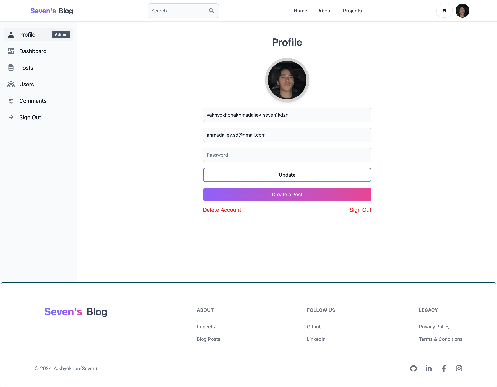

# MERN Stack Blog Website

Welcome to the MERN Stack Blog Website repository! This project showcases a blog application built using the MERN stack, combining MongoDB, Express.js, React, and Node.js, along with additional technologies for an enhanced user experience.</br>
<a href="https://blog-mern-04no.onrender.com/" >Visit the Live MERN Stack Blog Website</a>


## Project Overview

This blog website is a fully functional application where users can:

- **View Posts**: Explore blog posts across various categories.
- **Search and Sort**: Utilize advanced search functionality to filter posts by title, limit results, and sort through a modern sidebar.
- **Manage Content**: Admins can easily manage posts, comments, and users with full CRUD operations.
- **Interactive Features**: Users can leave, edit, and delete comments on posts.

### Key Features

- **Secure Access**: Both client and backend are secured for specific pages, including the admin dashboard.
- **Responsive Design**: The website is designed to be fully responsive, ensuring a seamless experience across various devices.
- **Dark Mode**: A sleek dark mode is available to enhance user experience and accommodate different preferences.
- **Advanced Search**: Cutting-edge search query techniques with MongoDB enable users to find posts quickly and efficiently.

## Technologies Used

- **Frontend**: React, Tailwind CSS, React Flowbite, Redux, React DOM
- **Backend**: Node.js, Express.js
- **Database**: MongoDB

## Getting Started

To get started with this project, follow these instructions:

### Prerequisites

Make sure you have the following installed:

- Node.js (v14.x or later)
- MongoDB (local or cloud instance)

### Installation

1. **Clone the Repository**

   ```bash
   git clone https://github.com/your-username/your-repo-name.git
   cd your-repo-name
   ```

2. **Install Backend Dependencies**

   ```bash
   in root
   npm install
   ```

3. **Install Frontend Dependencies**

   ```bash
   cd ./client
   npm install
   ```

4. **Configuration**

   - **Backend**: Create a `.env` file in the `backend` directory and add your MongoDB connection string and other environment variables.

     ```plaintext
     MONGODB_URI=your_mongodb_connection_string
     JWT_SECRET=your_jwt_secret
     ```

   - **Frontend**: Ensure your backend is running. add .env file in client folder for Firebase

     ```plaintext
     VITE_FIREBASE_API_KEY=
     VITE_FIREBASE_AUTH_DOMAIN=
     VITE_FIREBASE_PROJECT_ID=
     VITE_FIREBASE_STORAGE_BUCKET=
     VITE_FIREBASE_MESSAGING_SENDER_ID=
     VITE_FIREBASE_APP_ID=

     ```

5. **Run the Application**

   - **Backend**: Start the server

     ```bash
     cd ./
     npm run dev
     ```

   - **Frontend**: Start the React development server

     ```bash
     cd ../client
     npm run dev
     ```

   The application should now be running at `http://localhost:5173` (frontend) and `http://localhost:3000` (backend).

## Usage

- Navigate to `http://localhost:5173` to interact with the blog website.
- Admins can access the admin dashboard to manage posts, comments, and users. Ensure proper authentication and authorization are implemented.

## Contributing

If you would like to contribute to this project, please follow these steps:

1. Fork the repository.
2. Create a new branch (`git checkout -b feature/your-feature`).
3. Make your changes.
4. Commit your changes (`git commit -am 'Add new feature'`).
5. Push to the branch (`git push origin feature/your-feature`).
6. Open a pull request.


## Contact

If you have any questions or issues, please open an issue in the repository or contact [ahmadaliev.sd@gmail.com](mailto:ahmadaliev.sd@gmail.com)

---

Thank you for checking out the MERN Stack Blog Website! Enjoy exploring and contributing to the project.

